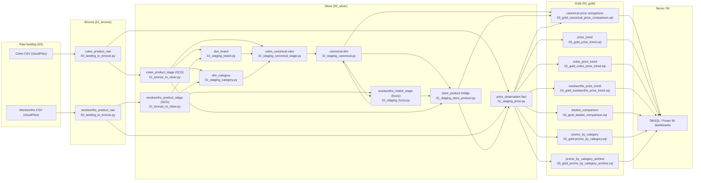
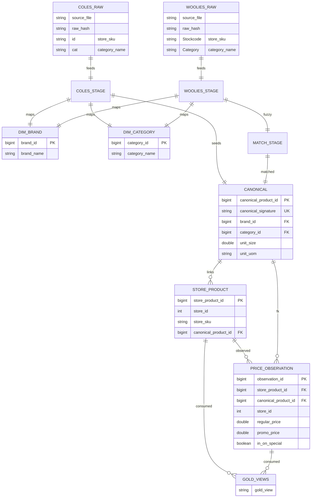
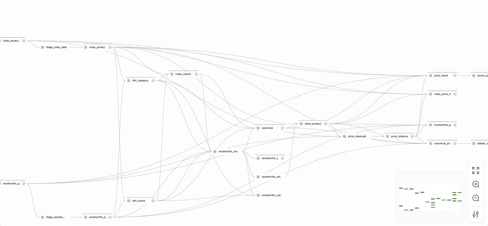

# ETL Pipeline for Grocery Price Analytics (Databricks / PySpark)

## Objective
- Continuously ingest Coles and Woolworths product/price files, standardize them, and produce canonical product keys so the two retailers can be compared.
- Deliver reliable downstream tables for BI (Power BI/DBSQL) to trend prices, promo lift, and basket comparisons.

## Approach & Tech stack
- **PySpark + Delta** for scalable, ACID append + schema evolution on raw retail data.
- **Databricks Lakeflow Declarative Pipelines** for declarative tables/views, CDC/SCD handling, built-in expectations, and native lineage/monitoring.
- **Auto Loader** (cloudFiles) to incrementally land S3 CSV with schema inference and evolution.
- **Delta CDF + streaming tables** to materialize SCD product stages and power incremental joins downstream.
- **Canonicalization + fuzzy matching**: seed the canonical dimension from Coles using deterministic signatures (brand_id + normalized name + unit size/uom); then extend with Woolworths fuzzy matches and unmatched payloads so both retailers share one product key space.
- **Medallion architecture**: Bronze (raw streaming landing), Silver (cleaned/SCD/dims/canonical), Gold (analytics SQL views) for business-level aggregations.

## Architecture (ETL flow)

## Pipeline steps
- **Landing → Bronze**: Auto Loader streams Coles/Woolworths CSV from S3, adds metadata (i.e. source file name), `raw_hash`, `ingestion_ts`, and basic unit parsing. This will feed into Coles/Woolies stage tables as upstream streaming sources.
- **Bronze → Silver staging**: Normalize names/categories, parse pack size, create SCD stage tables for both retailers with expectations on timestamps, store IDs, category presence, and SKU presence.
- **Dimensions**: Build `dim_brand` and `dim_category` from staged feeds (deduped, keyed).
- **Canonicalization**: Create deterministic signatures from Coles first; extend with Woolworths matches/unmatched payloads in the next step to grow the canonical dimension.
- **Matching**: Fuzzy match Woolworths → canonical within brand/category blocks; classify matches and route unmatched candidates into the canonical dimension.
- **Store-product bridge**: Persist store SKU from both retailers → canonical links with match status/score.
- **Pricing fact**: Normalize regular/promo prices, promo details, stock flags, and attach canonical/store_product IDs.
- **Gold views**: Price trends and price comparisons, promo lift per canonical product across both retailers.

## Design Notes
- **Watermark + dedup**: add watermarks before `dropDuplicates` on streaming inputs to bound state; use deterministic tie-breakers to avoid ID churn.
- **Schema management**: prefer explicit schemas/schema hints in Auto Loader to avoid inference drift so downstream data types stay consistent; keep bronze append-only/capture all changes (e.g. insertion, updates, deletion) as an event.
- **Deterministic keys**: derive canonical_product_id from stable signatures and merges and persist the mapping via a merge/identity column so the same signature keeps the same ID across runs; filter to current SCD records (`__END_AT IS NULL`) for stable joins.
- **Fuzzy performance**: block candidates (brand/category/unit) and cap large blocks to keep Pandas UDF fuzzy matching bounded; consider native Spark LSH for scale.
- **Quality gates**: expectations on timestamps, store IDs, categories, SKUs, and non-negative prices catch bad data early; monitor expectation metrics.
- **Data window**: current outputs are based on ~3 weeks of scraped data; refresh cadence and retention can be tuned as more history lands.

## Logical data model

## Data models (core tables/views)
- `01_bronze.coles_product_raw`, `01_bronze.woolworths_product_raw`: landed raw with metadata and `raw_hash`. Use (`source_file`, `raw_hash`) for de-dupe.
- `02_silver.coles_product_stage`, `02_silver.woolworths_product_stage`: SCD2 stage with normalized fields. Business key: (`store_id`, `store_sku`) with `__START_AT`, `__END_AT`.
- `02_silver.dim_brand` (PK `brand_id`), `02_silver.dim_category` (PK `category_id`): deduped dims keyed on `brand_name`/`category_name`.
- `coles_canonical` (view) + `02_silver.canonical`: canonical product dimension (PK `canonical_product_id` identity); business key `canonical_signature` (brand_id, canonical_name, unit_size, unit_uom).
- `woolworths_match_stage`, `02_silver.woolworths_store_product_matches`: fuzzy outputs keyed by (`store_id`, `store_sku`); FK to `canonical.canonical_product_id` when matched.
- `02_silver.store_product`: PK `store_product_id` (identity); FKs `canonical_product_id` → `canonical`, (`store_id`, `store_sku`) → stage tables; match_score/status for lineage.
- `02_silver.price_observation`: PK `observation_id` (identity); FKs `store_product_id` → `store_product`, `canonical_product_id` → `canonical`, `store_id` for convenience; measures: regular/promo prices, promo details, stock flags, timestamps.
- Gold: `03_gold_canonical_price_comparison`, `03_gold_price_trend`, `03_gold_coles_price_trend`, `03_gold_woolworths_price_trend`, `03_gold_basket_comparison`, `03_gold.promo_by_category`, `03_gold_promo_by_category_archive` consume the above FKs for analytics.

## Assumptions
- Store IDs are fixed: Coles = 1000, Woolworths = 1001.
- Category mappings are maintained in-code (can be externalized); unmapped categories are dropped by expectation.
- `canonical_signature` uniquely identifies a product (brand, normalized name, unit size/uom).
- Raw file exclusions are config-driven (e.g., `pipeline.excluded_paths`)
- `store_sku` is unique per `store_id`; staging business keys and SCD handling depend on that constraint.

## Data quality
- Databricks Pipelines expectations drop bad records early (timestamp, SKU, category, store_id, non-negative prices).
- SCD staging keeps history with CDC-enabled tables.
- Hash-based de-dupe (`raw_hash`) prevents duplicate ingestion.

## Dashboard note
- A snapshot of the Databricks pipeline and a price-comparison dashboard to demonstrate lineage and BI outcomes.

